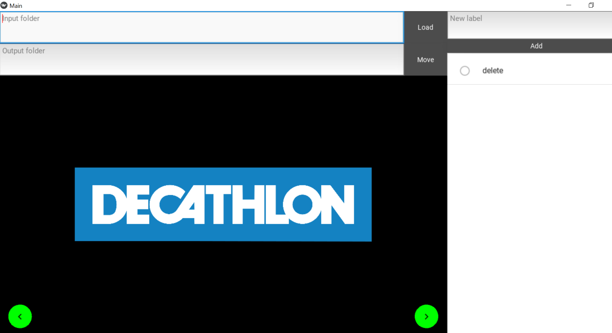

# Image labeling app

This is a python app built with the kivy and kivyMD packages that helps labeling images to train image classification models.

To use the app use `python 3.8` and install the necessary package
```
pip install kivymd==0.104.2
```
Then simply start the app
```
python app.py
```

It is also possible to package the app for easier use. For windows, this [method](https://dev.to/ngonidzashe/using-pyinstaller-to-package-kivy-and-kivymd-desktop-apps-2fmj) seems to work.

## How it works



The app has a very simple interface. Here is how to use it:
- Specify the folder where your images are located and either press ENTER of hit the `load``button to load the images.
- Add the possible labels by doing the same thing in the `new label` box.
- Hit the arrows on the app or on your keyboard to go through your images and select the correct label. You can also select to delete the image.
- Once you are happy with your labels you can specify a directory where the images should be moved and hit the `move` button to move (or delete) them. A subdirectory will be created for each label.

Note: An interesting modification to do in the future would be to use kivy's file explorer widget instead of using a text input.

If you want many examples of cool apps made with kivy, there is a big lsit [here](https://github.com/kivy/kivy/wiki/List-of-Kivy-Projects).