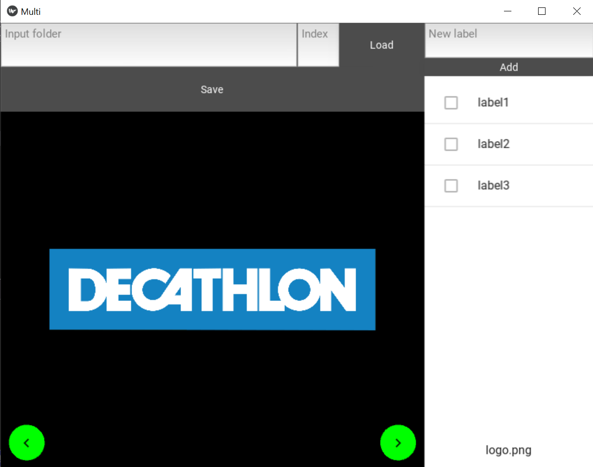

# Image labeling app

This is a python app built with the kivy and kivyMD packages that helps labeling images to train image classification models.

To use the app use `python 3.8` and install the necessary package
```
pip install kivymd==0.104.2
```
Then simply start the app
```
python app.py
```
or start the multilabel version of the app
```
python app_multi.py
```

It is also possible to package the app for easier use. For windows, this [method](https://dev.to/ngonidzashe/using-pyinstaller-to-package-kivy-and-kivymd-desktop-apps-2fmj) seems to work.

## Single label app


The goal of this app is to start with images in a single folder and move them into separate folders, which represent the labels. 
This is used for single label classification.

The app has a very simple interface. Here is how to use it:
- Specify the folder where your images are located and either press ENTER of hit the `load` button to load the images.
- Add the possible labels by doing the same thing in the `new label` box.
- Hit the arrows on the app or on your keyboard to go through your images and select the correct label. You can also select to delete the image.
- Once you are happy with your labels you can specify a directory where the images should be moved and hit the `move` button to move (or delete) them. A subdirectory will be created for each label.

## Multilabel app



This version of the app is useful in cases where many labels can be attached to a single image. The input is a folder 
with all the images and the result is a json file with the list of labels for each image. The keys of the json are the 
image paths and the values are lists of labels.

Here is how to use the app:
- Specify the folder where your images are located and either press ENTER of hit the `load` button to load the images. You can also specify where in the list of images you want to start by typing the index.
- If `labels.json` is in the image folder it will be loaded and the labels will be added to the app. Else a json is created with empty labels for each image.
- Add possible labels using the `new label` box.
- Hit the arrows on the app or on your keyboard to go through your images and select the correct labels.
- Every once in a while you can hit the `save` button to save the updated json file.

## Other things

Note: An interesting modification to do in the future would be to use kivy's file explorer widget instead of using a text input.

If you want many examples of cool apps made with kivy, there is a big lsit [here](https://github.com/kivy/kivy/wiki/List-of-Kivy-Projects).